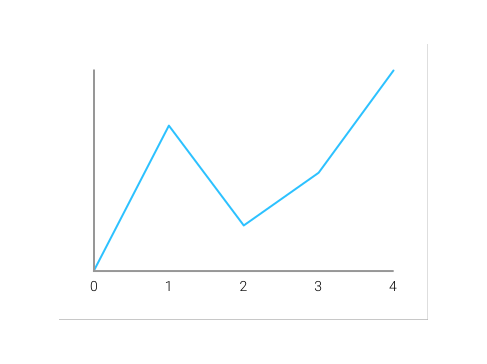

## Charter
Another chart library for Android.

[](http://kotlinlang.org)
[](https://travis-ci.org/Karn/charter)
[](https://codecov.io/gh/Karn/charter)
[
](./../../releases)


#### GETTING STARTED
Charter (pre-)releases are available via JitPack. It is recommended that a specific release version is selected when using the library in production as there may be breaking changes at anytime.

> **Tip:** Test out the canary channel to try out features by using the latest develop snapshot; `develop-SNAPSHOT`.

``` Groovy
// Project level build.gradle
// ...
repositories {
    maven { url 'https://jitpack.io' }
}
// ...

// Module level build.gradle
dependencies {
    // Replace version with release version, e.g. 1.0.0-alpha, -SNAPSHOT
    implementation "io.karn:charter:[VERSION]"
}
```


#### USAGE

The most basic case of the `LineChart` is as follows:

Create the object within your layout.
```XML
<io.karn.charter.charts.LineChart
    android:id="@+id/chart"
    android:layout_width="match_parent"
    android:layout_height="200dp"
    app:axisColor="@android:color/darker_gray"
    app:labelColor="@android:color/black" />
```
Attach the data to the Chart.
```Kotlin
val dataMatrix = LineChart.DataMatrix(
    // X-Axis Labels
    arrayListOf("0", "1", "2", "3", "4"),
    // Data
    arrayListOf(
         LineChart.DataObject(
            "Score", // Label of the data which is used for the legend.
            0x2CC1FF, // The color code of the data points.
            arrayListOf(145f, 230f, 170f, 200f, 300f) // The data points -- must be of the same length as a the X-Axis labels.
        )
        // ...
    )
)

// Settings the data automatically refreshes the chart.
chart.setData(dataMatrix)
// You can also react to the nodes that are clicked by attaching a click handler.
deltas_chart.setOnTooltipChanged { nodes -> // nodes: List<Pair<String, Float>>
    // Iterate through the list of data points at that X-Axis index.
    for (item in nodes) {
        Log.v(TAG, "${item.first}: ${item.second}.")
    }
}
```

You'll get something that looks like this:



 > The headings and legend are left to the developer who can add that data in surrounding views.

#### CONTRIBUTING
There are many ways to [contribute](./.github/CONTRIBUTING.md), you can
- submit bugs,
- help track issues,
- review code changes.
